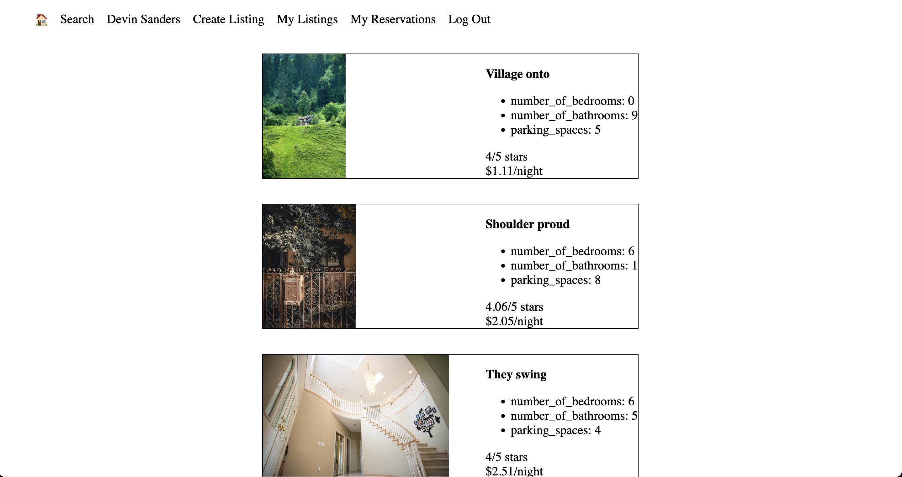
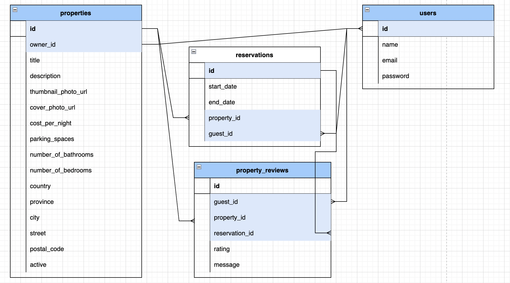

# LightBnB

A simple multi-page AirBnB clone that uses server-side Javascript to display the information from queries to web pages via SQL queries.

## Web App Image

## Setup
1. Clone this repository
2. Open your terminal and cd into the directory
3. Install dependencies with npm install
4. Run the following command to connect to psql: psql -h localhost -p 5432 -U labber lightbnb and enter the password "123"
5. Enter command into psql session: \i migrations/01_schema.sql
6. Enter command into psql session: \i seeds/04_seeds.sql
7. Enter \q to exit psql session

## Project Structure
```
├── public
│   ├── index.html
│   ├── javascript
│   │   ├── components 
│   │   │   ├── header.js
│   │   │   ├── login_form.js
│   │   │   ├── new_property_form.js
│   │   │   ├── property_listing.js
│   │   │   ├── property_listings.js
│   │   │   ├── search_form.js
│   │   │   └── signup_form.js
│   │   ├── index.js
│   │   ├── libraries
│   │   ├── network.js
│   │   └── views_manager.js
│   └── styles
├── sass
└── server
  ├── apiRoutes.js
  ├── database.js
  ├── json
  ├── server.js
  └── userRoutes.js
```

* `public` contains all of the HTML, CSS, and client side JavaScript. 
  * `index.html` is the entry point to the application. It's the only html page because this is a single page application.
  * `javascript` contains all of the client side javascript files.
    * `index.js` starts up the application by rendering the listings.
    * `network.js` manages all ajax requests to the server.
    * `views_manager.js` manages which components appear on screen.
    * `components` contains all of the individual html components. They are all created using jQuery.
* `sass` contains all of the sass files. 
* `server` contains all of the server side and database code.
  * `server.js` is the entry point to the application. This connects the routes to the database.
  * `apiRoutes.js` and `userRoutes.js` are responsible for any HTTP requests to `/users/something` or `/api/something`. 
  * `json` is a directory that contains a bunch of dummy data in `.json` files.
  * `database.js` is responsible for all queries to the database. It doesn't currently connect to any database, all it does is return data from `.json` files.

  ## Database Structure
  

  ## Dependencies 
  ```
  "bcrypt": "^5.1.0",
    "body-parser": "^1.19.0",
    "cookie-session": "^1.3.3",
    "express": "^4.17.1",
    "nodemon": "^2.0.20",
    "pg": "^8.8.0"
    ```